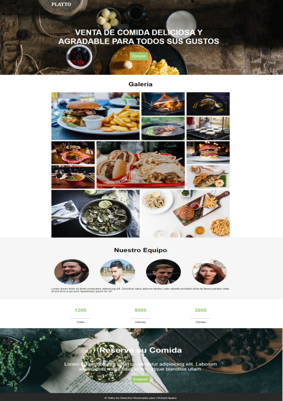

# restaurante ETITC
es un pequeño ejercicio hecho con el fin de practicar html, css y javascript copiando una imagen como referencia la siguiente imagen.
Nota: se podian hacer ligeras modificaciones pero se debia basar la mayoria en el modelo original

